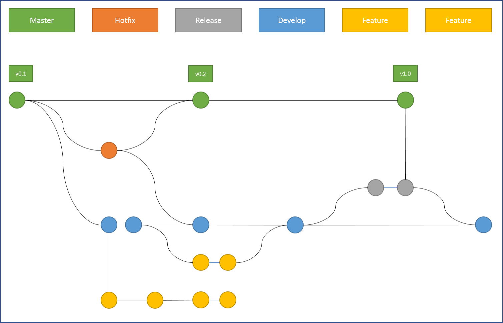

# Shrello Webpart

This webpart is compatible with 2016 Server. It checks for necessary Lists and provisions them if needed. The code is found in the src folder and is organized into 3 folders: assets, utilities and webparts.

## IMPORTANT INFO
You need to change the launch.json file to show your sever location.

## Development

All development should be done on the development branch. Create features from dev branch and when ready for release create a release branch from dev for review prior to merge with master. Remember to rebase often!



### Building the code

```bash
git clone the repo
npm i
npm i -g gulp
gulp
```

This package produces the following:

* lib/* - intermediate-stage commonjs build artifacts
* dist/* - the bundled script, along with other resources
* deploy/* - all resources which should be uploaded to a CDN.

### Build options

gulp clean - TODO
gulp test - TODO
gulp serve - TODO
gulp bundle - TODO
gulp package-solution - TODO
